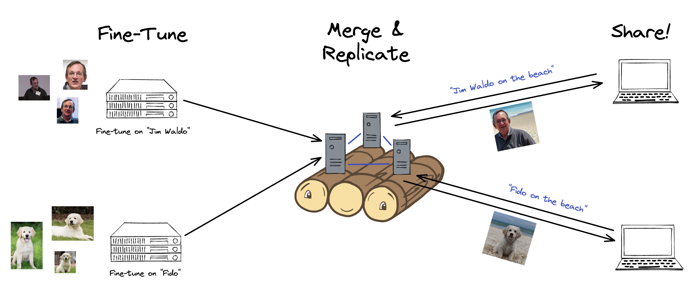

# Teambooth: Distributed Fine-Tuning of Dreambooth Models with Raft



*Teambooth allows users fine-tune dreambooth models on their own images in a federated manner. These models are merged in a cohort of central servers, which also serve generation requests from other users.*

Code is being refactored right now to create a GUI user experience. Created for CS 262 @ Harvard.

**To run the legacy code (under `grpc`)**:

```
sh init.sh
cd diffusers/examples/dreambooth
```

To run the server:
```
python3 main.py --server --port [server port] --server_id [server_id] --hosted_model_id [initial model ID in S3]
```

To run the client:
```
python3 main.sh --servers [address:port,address:port,...]
```

You can then use option 0 to download the latest model and 2 to see detailed instructions about training an update to the model. Note that this training process is largely the client's own responsibility, and the client can adjust the options passed accordingly. Then, a conversion script must be used to regenerate a .ckpt file, and option 1 can be used to merge this with the current model.
