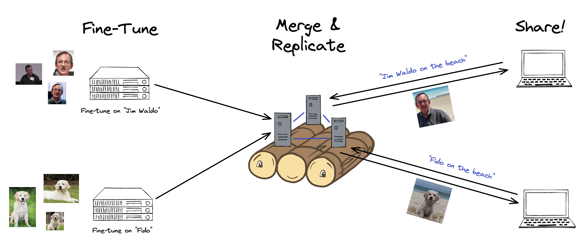

# Teambooth: Distributed Fine-Tuning of Dreambooth Models

by Jeffrey Wang and Marco Burstein.

## Opening Notes

This document is written in Markdown. Our past engineering notebooks were written in Markdown, so our notebook for this project began in that format too; we then thought it would be cleaner to keep the engineering notebook / technical writing along with the main report, hence why this format has persisted. We have still structured this as a full report, with figures, tables, and a bibliography. The report is 6-10 pages. 

After that, a `README`-style document is available with more technical details (installation, user manual, testing, etc.).

*Links*:
- [GitHub Repo](https://github.com/marco/cs262p4/ )
- [Presentation](https://drive.google.com/file/d/132SuK_F3EdkcoqTX8W7Vsj0j1_hhCKgY/view?usp=share_link) (.key file)

## Introduction


*Figure 1: A graphic of the Teambooth application. Users fine-tune dreambooth models on their own images in a federated manner, these models are merged in a cohort of central servers, which also serve generation requests from other users.*

**Background**

Dreambooth [1] is a generative AI model based on stable diffusion that enables photorealistic generation of subjects from a given text prompt in different contexts. Given just a few novel sample images that represent a given subject, Dreambooth models allow users to generate their subject in any context using only natural language. Since its release in mid-2022, Dreambooth-enabled generation has taken the world by storm—which naturally prompts the question: how can I do this too?

To the best of the authors' knowledge, there is currently no "drag and drop" version of Dreambooth. In fact, the only way we found to access it is via a few costly subscription plans, the [cheapest](https://getimg.ai/pricing) of which is a $12 monthly subscription for two generations.  On some level, despite how magical Dreambooth generations can be, its lack of accessibility is no surprise: fine-tuning is incredibly expensive and time-consuming. Offering such a free service is simply not scalable because the unit economics do not make sense.

Nevertheless, there is one important fact of Dreambooth and many generative AI models in general: that *generation* of a given subject in some context is far cheaper than *fine-tuning* that subject into the model. In other words, once a subject has been "trained in", generating that subject is a cheap operation. This aligns well with what we envision to be a likely end user of a Dreambooth application: someone who wishes to fine-tune on just a few subjects (e.g. their dog, their friend, etc.) but then generate and share many times. Pithily: light on fine-tuning, heavy on generation, and social.

As a result, a federated learning approach can make Dreambooth (and other compute-intensive, personalized generative AI models) much more accessible. While federated learning's primary application has traditionally been in privacy contexts, the other aspect—distributing the actual training of the model—makes a lot of sense here. Users take on up-front compute for fine-tuning, while their eventual central server model can be shared with others. In this report, we do exactly that for Dreambooth. Below, we:
- Outline the distributed paradigm of Teambooth
- Describe engineering challenges and compromises that have gone into our application
- Illustrate the user experience for generators and fine-tuners
- Summarize the compellingly unit economics of this changed model

After the "report" section, we have an engineering notebook that describes installation, user interactions, and more.

**Introduction to Teambooth**

For the sake of brevity, we omit a full description of Dreambooth's mathematical workings here. Readers intersted in the mathematical derivation may consider the original papers for Dreambooth and Stable Diffusion [1, 2]. Our focus in this report will be describing our engineering decisions, challenges, and tests. In this section, we'll introduce vocabulary and context that's relevant throughout our report.

First, we should note that we did not implement Dreambooth from scratch. Startups have raised billions of dollars [4, 5, 6] doing so; for our purposes, we used open-source libraries [7, 8] built on PyTorch to instantiate the model itself. Here, we will treat the Dreambooth model as a black box, with three key operations:
- FINE-TUNE (aka TRAIN): A client fine-tunes the global model with custom images.
- MERGE: The server merges a client fine-tuned model with the global model. 
- INFER: A client runs inference for a given model.

In our implementation, the clients perform all of the real computation (fine-tuning and generation). The only thing the server does is merge client models, and serve "GET" requests from clients who wish to fine-tune or run inference on the existing global model (the clients then perform the computation themselves). More details on these design decisions are available later.

Finally, throughout this report, we refer to three different "user types" of our code:
- Server: The backend running the application.
- Client Fine-Tuner: A client that requests the model, fine-tunes it, and sends it back.
- Client Requestor: A client that wishes to generate a specific subject that the application has been fine-tuned on. S/he requests the model and runs inference (with CLI/GUI options).

**Distributed Paradigm**

At initial glance, it isn't clear that "federated" is necessarily "better" here: while the federated learning approach does "distribute" the computation, the architecture remains one that is client-server. Indeed, with one central server and many clients, many of the challenges of creating a distributed architecture can be avoided.

However, such an approach does not scale well with many users, since every user-tuned model needs to be "merged" back into the global one. During these merges, other clients cannot be serviced. Consider, for instance, the following user scenario:

(A) There is an initial server only fine-tuned on images of Waldo.

(B) Next, a client fine-tuner requests the model, receives it, and begins fine-tuning on her golden retriever.

(C) While that occurs, a client requestor can still request generation of e.g. "Waldo on the beach."

(D) When the first fine-tuner finishes, the central server takes a while to merge.

(E) During that time, using a single server, another client requestor must wait until merging is finished until requesting generation of Waldo again.


*Figure 2: Servicing challenges during merges.*

In our testing, merges usually take ~2-5 minutes. In a single server, this is downtime where GET requests from other clients for the model cannot be served. As such, running with a single central server to handle all FINE-TUNE/MERGE/INFER requests would cause significant latency; one can easily imagine a long queue of merges blocking clients that simply wish to fetch the model to do their fine-tuning.

Hypothetically, these problems could be ameliorated with one central server running an asynchronous event loop. However, doing so would place all of the servicing burden on one machine and is not fault-tolerant whatsoever. Additionally, this approach is not extensible at all—it does not, for instance, allow for more than one machine at a time doing merges. As a result, we opted for a distributed paradigm with one machine performing MERGEs, and the other machines serving FINE-TUNE and INFER requests (essentially GET) requests.

This ensures that our application has essentially 100% uptime. The distributed paradigm here therefore makes our application more fault-tolerant, more reliable, and more extensible. (While MERGEs may still have a queue here, a natural extension is making more than one machine MERGE at a time.)

**Engineering Overview**

One major engineering challenge was figuring out how to create a "federated" model when interacting with a Dreambooth model is time- and compute-intensive. The base "image" for Dreambooth before fine-tuning, for instance, is over 3 gigabytes. We felt that sending these models over the wire would be prohibitively time-consuming and prone to failure. Additionally, since most existing users of these models do not have GPU's on their local machines; they likely use some cloud GPU provider to access their compute.

As such, the first major engineering decision we made was to make Teambooth AWS-native. In AWS, all entities stored in S3, the AWS-native storage solution, are referenced by specific ID's. As a result, rather than sending enormous models over the wire, we simply send small packets of ID information—something for which we used gRPC. While there is still plenty of hair in consensus here, it is far simpler than maintaining consistency with gigabyte-sized models.

By using this simplification, keeping the PR and SR models in sync reduces to keeping a log updated between PR and SR replicas with the right "current global model." In our application, we use Raft [3] to do so. A brief description is offered below:
- Raft divides the distributed consensus problem into three subproblems: leader election, log replication, and safety.
- In Raft, there is a leader who is responsible for managing the replication of the log. Other nodes are followers, which replicate the log. This is the primary/secondary or leader/follower approach to consensus.
- If the leader fails, a new leader is elected using a randomized timeout mechanism. In brief, every non-leader replica starts as a follower, sending heartbeat pings to the leader at random intervals. Whenever a replica does not get a heartbeat from a leader, it becomes a _candidate_ for the leader, sending out requests for votes to other replicas; if a majority of other nodes get its candidacy request and vote for it, it becomes the leader.
- The leader receives commands from clients and appends them to its log. The leader then replicates its log to its followers, who in turn replicate it to other followers.
- Raft ensures safety by enforcing a rule that a log entry can only be committed if it has been replicated on a majority of the nodes.

One asterisk of our implementation is that all server-server communication is done via the heartbeats, since the data packages are small (just packets containing e.g. ID info). Other than that, by reduction to an AWS-specific platform, we simplify the complex problem of maintaining consistency into a standard version of Raft.

As noted in the beginning, in our implementation, the PR handles all MERGEs and the SR machines handle all FINE-TUNE and INFER requests; these amount to serving GET requests of the latest model version. We currently handle this in a simple way; on boot, a client must enter the IPs of all PR/SR machines, and processing of where to send requess is done on the client side. In a production application, we would implement a reverse proxy (which could also be distributed, to avoid a single point of failure) on the server side to handle this.

**Use Cases and Benefits: Who Wins?**

Given the above implementation, the final use scenario with the servers up would look as follow:
- Different users that want to FINE-TUNE can request the global model and train on specific subjects.
- As fine-tuning finishes for users at different times (because of compute capabilities), they send the model back to the primary server, which runs MERGE on those models into the global model.
	- Any time the PR finishes a merge, it propagates that new model ID to secondary replicas.
- Any time a client wishes to INFER, they send a request to an SR, which serves the most recent model ID.

We believe the clients and the server wins here. Clients win because they can run Dreambooth in a fairly accessible way, avoiding exorbitant pricing from sharky online services. The server wins because they can offload most compute to the client, making a sharable "Dreambooth-as-a-service" application immensely more scalable.

**Engineering Challenges**

*Concept Drift*. One of the major challenges we faced was **concept drift.** To describe it, we first clarify how text-to-image pipelines  actually work. While Dreambooth depictions, like ours in Figure 1, typically show a prompt akin to "Jim Waldo on the beach", reality is slightly less seductive. One major challenge of natural language text-to-image pipelines is *concept differentiation*: how can a model differentiate between a prompt asking for any dog and one asking for a user's *specific* dog? In practice, the distinction is drawn from some embeddings of the natural language prompt, where the model must differentiate e.g. the vector for "my golden retriever" vs. "a golden retriever." Since this is a fairly subtle task and the alignment between "embedding distance in high dimensional space" and "semantic differentiation" is sometimes nebulous, Dreambooth works by using very specific and short text classifiers (which usually translate to 1-2 very specific tokens in a given prompt). For instance, to fine-tune on images of Prof. Waldo, our prompt might refer to him as "jhw person." To fine-tune on a golden retriever or a car, we might refer to our subjects as "grt dog" or "tsla car."

In practice, we found that the differentiation did not always work perfectly. For instance, when fine-tuning a base model first on "jhw" person (Prof Waldo), and then afterward on"gwj" person (Jeffrey, with his initial reversed), the end result when generating Jeffrey or Prof Waldo would often look like a mix of the two subjects (Figure 3). This effect persisted when we used completely random identifiers.


*Figure 3: Concept Drift. Fine-tuning on multiple people can lead to confused representations.*

We hypothesize that this occured because the 3-letter embeddings, even when random, were still not specific enough to distinguish the subjects. For our current application, there is not workaround to this, although as a future extension we could ask users for the subject they are uploading and not allow future users to upload that subject. One vulnerability of this solution is that it is easily susceptible to "poisoning" attacks, where a user lies about the subject they upload to prevent other users from full application functionality.

*Vanishing.* Naturally, as different subjects get merged into the model, it becomes harder to generate good images of those that were fine-tuned in the distant past. Because fine-tuning on a single takes hours of compute (see "unit economics" section), we were unable to fully test the empirical effects of "vanishing" subjects. However, one workaround to the vanishing effect is making the global model somewhat ephemeral (e.g. reset the model and the servers' list of subjects to base every 24 hours).

**Experiments, Tests, and Unit Economics of Teambooth**

Testing this application was difficult because of the intense compute. We had GRPC unit tests and tested the fault-tolerance of our application. See `Testing/Resilience` in the second part of our report for more on that. As such, most of our experiments for this report were on proof-of-viability, as we tested the feasability and appeal of this approach from a unit economics perspective.

Using `g3.xlarge` [instances](https://aws.amazon.com/ec2/instance-types/g3/), which are NVIDIA Tesla M60 GPUs with 2048 parallel processing cores and 8-32 GiB of GPU memory, fine-tuning to good quality takes on the order of 10 minutes to 2 hours, depending on hyperparameter configurations and machine type (we used 800 fine-tuning iterations). Generation of an image, on the other hand, takes 5-60 seconds: anywhere from 1-3 orders of magnitude less. As such, given that these machines run from $0.75/hr to $4.56/hr, a single generation costs about $1-2 on average for the client. See table below:

| Instance Type | Time for Fine-Tuning | Cost/Hr ($) | Approx Cost per Fine-Tune |
| -------- | -------- | -------- | -------- |
|   g3s.xlarge (8GB GPU RAM)    |   ~2 hours     |      0.75    |       2.25   |
|   g3.4xlarge   (8GB GPU RAM)     |     ~1 hour     |    1.14      |     1.14    |
|     g3.8xlarge  (16GB GPU RAM)    |     ~30 mins     |      2.28    |    1.14    |
|     g3.16xlarge    (32GB GPU RAM)  |    ~10 mins      |      4.56    |     0.46   |

> One detail we omit here is that running on smaller instances (with limited GPU RAM) often requires parallelization and memory-reduction techniques like [gradient checkpointing](https://huggingface.co/docs/transformers/v4.18.0/en/performance) and [DeepSpeed](https://github.com/microsoft/DeepSpeed), hence why the times do not scale linearly with e.g. GPU RAM.

Once a model has been fine-tuned, generating Dreambooth context variations is similarly affordable. For generation, we used 50 diffusion steps in generation on a g3.16xlarge, which took approximately 10 seconds. With these unit economics, one could generate approximately 80 different Dreambooth instances per dollar of compute. All in all, this is more cost efficient for clients than existing models.

The real winnings come for the servers. By offloading compute to clients, much more is possible. Using the most powerful instance here (`g3.16xlarge`), a single client-server model could service at maximum 144 (6 * 24) fine-tunes per day, at $109.44 in compute.

In our testing, we ran merges with the smallest instance, a `g3s.xlarge`, where they take approx 2-5 minutes. Now considering a distributed paradigm, assuming an average of ~3.3 minutes per merge, the primary server could handle 3x the number of clients at 0.75/4.56 = 16 percent of the cost. The secondary replicas would only need to serve GET requests, so they could be AWS's cheapest machines (which run at approximately 1 cent/hour). All in all, this comes out to be 18x more efficient (on a number-of-daily-clients-per-cent basis) for servers vs. the central server-client model—savings which do not take into account increased uptime and fault tolerance from distribution.

One alternative to merging into a global model, given the "concept drift" and "vanishing" effects, is to simply store all client models. One issue with this paradigm is that each fine-tuned model is ~3GB in size, which scales quickly with users. However, from a compute perspective, it is even more efficient than our model (which needs merges) and similarly cost-effective at a small scale given how cheap storage is.

**Future Extensions**

With our current work, we hope that we demonstrate a viable way to train Dreambooth in a distributed way. In production, there are a number of improvements we'd consider, including adding a reverse proxy so that clients don't need to specify PR/SR addresses, and parallelizing MERGEs across more machines (this could result in sharding the model across multiple devices, which might help address "vanishing" issues).

Other potential improvements for the future include:

- **Easier conversion between `.ckpt` and diffusers representation**. Currently, an additional command is required to convert from the diffusers directory-based model representation and the `.ckpt` format used for zipping and merging models. In the future, automating this process would make generating and using models easier.
- **Class image support**. Dreambooth generally performs better when generic "class images" are provided for comparison against the specific instance images.
- **Bundling everything into a GUI**: right now, everything is run from the CLI. We wrote a simple web app to upload images (rather than e.g. scp'ing them onto your AWS instance), but since the CLI needs to be used anyway (in order to specify server IP's), it is not fully functional. We imagine another lap of development, which would add a reverse proxy server-side, would remove the client CLI and make all user interactions through the GUI. 


*Figure 4: The cosmetic GUI. Users can upload photos for fine-tuning, or request a specific subject from the model.*

## References

[1] Ruiz, Nataniel, et al. "Dreambooth: Fine tuning text-to-image diffusion models for subject-driven generation." _arXiv preprint arXiv:2208.12242_ (2022).

[2] Rombach, Robin, et al. "High-resolution image synthesis with latent diffusion models." _Proceedings of the IEEE/CVF Conference on Computer Vision and Pattern Recognition_. 2022.

[3] Ongaro, Diego, and John Ousterhout. "In search of an understandable consensus algorithm." _2014 {USENIX} Annual Technical Conference ({USENIX}{ATC} 14)_. 2014.

[4]Roof, Katie, et al. “Stability AI Looks to Raise Funds at $4B Valuation as Artificial Intelligence Captivates Investors.” _Fortune_, Fortune, 4 Mar. 2023, https://fortune.com/2023/03/04/stability-ai-raise-funds-4-billion-valuation-artificial-intelligence-captivates-investors/.

[5] Cai, Kenrick. “Runway Raises $50 Million at $500 Million Valuation as Generative AI Craze Continues.” _Forbes_, Forbes Magazine, 6 Dec. 2022, https://www.forbes.com/sites/kenrickcai/2022/12/05/runway-ml-series-c-funding-500-million-valuation/.

[6] Generating ‘smarter’ biotechnology. _Nat Biotechnol_ **41**, 157 (2023). https://doi.org/10.1038/s41587-023-01695-x

[7] von Platen, P., Patil, S., Lozhkov, A., Cuenca, P., Lambert, N., Rasul, K., Davaadorj, M., & Wolf, T. Diffusers: State-of-the-art diffusion models (Version 0.12.1) [Computer software]. https://github.com/huggingface/diffusers

[8] Shirirao, S. Diffusers: Diffusers: State-of-the-art diffusion models (Dreambooth Fork). https://github.com/ShivamShrirao/diffusers


# Part 2: Technical/User Details (i,e. a README)

Information on installation, testing, and style are below.

#### Installation

Different users will need different packages. We offer detailed instructions for each user type below; this is a high-level summary:
- Python 3.10+
- grpcio (server)
- protobuf (server)
- stable diffusion packages (client generator / server)
	- accelerate
	- torchvision
	- transformers>=4.25.1
	- ftfy
	- tensorboard
	- Jinja2
	- safetensors
	- xformers

Note that the server has similar dependencies as a client generator, with gRPC to do inter-server communication. Note also that in a real deployment, the "client requestor" would likely use some pre-served web application. For this project, we opted to make that simply a locally-run GUI using a simple React app; it can also be run through the command line as well.

**Installation**

The easiest way to install and build the relevant dependancies for both either a server or a client is to run:

```sh
sh init.sh
```

From here, you can `cd diffusers/examples/dreambooth` and activate the virtual environment within this directory.

Then, you can run either the server or the client.

**Server**

To run the server, run:

```
python3 main.py --server --port [server port] --server_id [server_id] --hosted_model_id [initial model ID in S3]
```

Notice that there must already be a `.ckpt` uploaded to S3 to pass as an argument to the server. More options are available with `--help`.

**Client**

Similarly, to run the client, use:

```
python3 main.sh --servers [address:port,address:port,...]
```

You can then use option `0` to download the latest model and `2` to see detailed instructions about training an update to the model. Note that this training process is largely the client's own responsibility, and the client can adjust the options passed accordingly. Then, a conversion script must be used to regenerate a `.ckpt` file, and option `1` can be used to merge this with the current model.

**Client GUI**

Because some CLI interaction is needed to run the app (you have to specify port:address locations), the GUI is largely cosmetic at the moment. It can still be booted up with: 

```
# In `server`
python3 -m venv env
source env/bin/activate
pip3 install -r requirements.txt

# Inside `web`
npm install
```

Then, run: 
```
# Inside `web`:
npm start

# Inside `web` again:
npm run start-api
```

### Testing/Resilience

We had unit tests from previous problem sets for our GRPC messaging service. Because image generation is pretty hard to "test" (e.g. takes hours), we didn't include unit tests for the quality of the image generations. On the server side, we tested Raft across a dynamic set of environments, which we believe encompass much of the "hair" of the implementation:

| Tests | 3M:NM1 | 3M:NM2 | 3M:CR1 | 3M:CR2 | 5M:CR2 | 5M:CR4 |
| :--- | :----: | :---: | :----: | :----: | :----: | :---: |
| Status | ✅ | ✅ | ✅ | ✅ | ✅ | ✅ |

which correspond to:

- 3M:NM1 - 3 Machines where a network failure cuts off 1 machines.
- 3M:NM2 - 3 Machines where a network failure cuts off 2 machines.
- 3M:CR1 - 3 Machines where one machine crashes (cmd+c).
- 3M:CR2 - 3 Machines where two machines crash (cmd+c).
- 5M:CR2 - 5 Machines where two machines crash (cmd+c).
- 5M:CR4 - 5 Machines where four machines crash (cmd+c).

### Style

Our code adheres to the PEP-8 style guide in Python.
